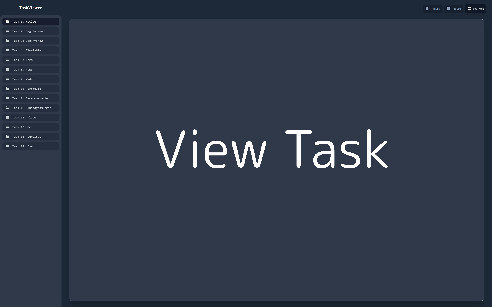

# TaskViewer

## Purpose

TaskViewer is a focused web portal for presenting internship tasks and
completed solutions in a clean, organized interface. The project
provides a single place where all work can be reviewed directly online.

## Mentor Workflow

``` md
1. Open the live site link  
2. Select a task from the sidebar  
3. View task details, images, and submitted solutions in the main panel  
4. Navigate easily between assignments
```

## Benefits

-   Review work through **one shareable link**\
-   No need to use Google Drive\
-   No repeated downloads or manual file browsing\
-   Tasks are structured for quick visibility\
-   Responsive layout for mobile, tablet, and desktop

## Live Site

👉 https://task-viewer-blush.vercel.app/

## Features

-   Sidebar task navigation\
-   Image-supported documents\
-   Fast loading on Vercel\
-   Simple and readable design

## Repository Usage

``` md
- The portal displays each task with description and output  
- Content updates reflect daily internship progress  
- Designed to simplify the review experience
```

------------------------------------------------------------------------

### Screenshot



*Note: All tasks are accessible online for easy viewing.*
